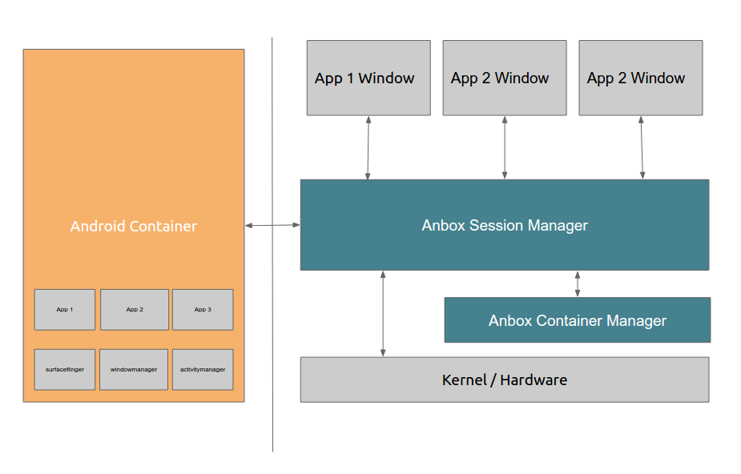

# Overview

The Anbox runtime consists mainly of two separate instances:

 * container manager
 * session manager

The container manager has the job of managing the container setup and maintenance
during its lifetime. It has the responsibility to start the LXC environment we're
using to run the Android system.

The session manager runs inside the session of a user logged into the Linux system.
It will communicate over several sockets with the Android instance running inside
the container and provide integration with the Linux system. It also acts as a
multiplexer to map Android applications into single windows on the desktop
environment. Currently all application windows are owned by the same process
(the session manager). The application logic itself is still in a separate process
inside the Android container.

The following picture shows an overview over the architecture:

### Prebuilt Android Images
The repository does not contain an android image. Either [build android from source](https://github.com/anbox/anbox/blob/master/docs/build-android.md) or download a prebuilt image from [here](https://build.anbox.io/android-images/ "anbox.io"). 

## Application Mapping

Android applications are mapped into single windows within the desktop environment.
This is achieved by plugging into the Android hwcomposer HAL module which receives
a set of layers to composite on a screen. Anbox tells SurfaceFlinger through its
hwcomposer implementation to get a layer for each application and combines this with
additional information it receives from the Android WindowManager to map individual
layers to applications. For more details please look into the implementation at

 * android/hwcomposer
 * src/anbox/graphics/layer_composer.cpp
 * src/anbox/wm/manager.cpp
